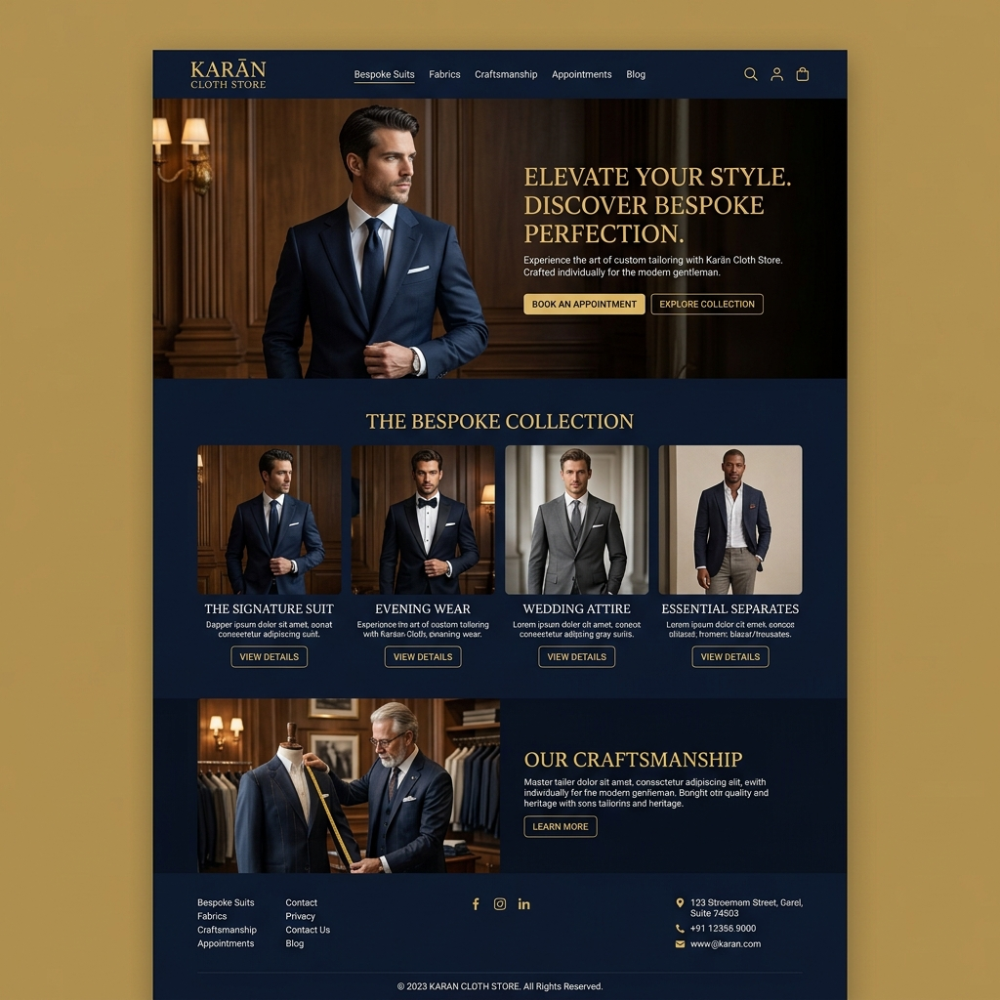
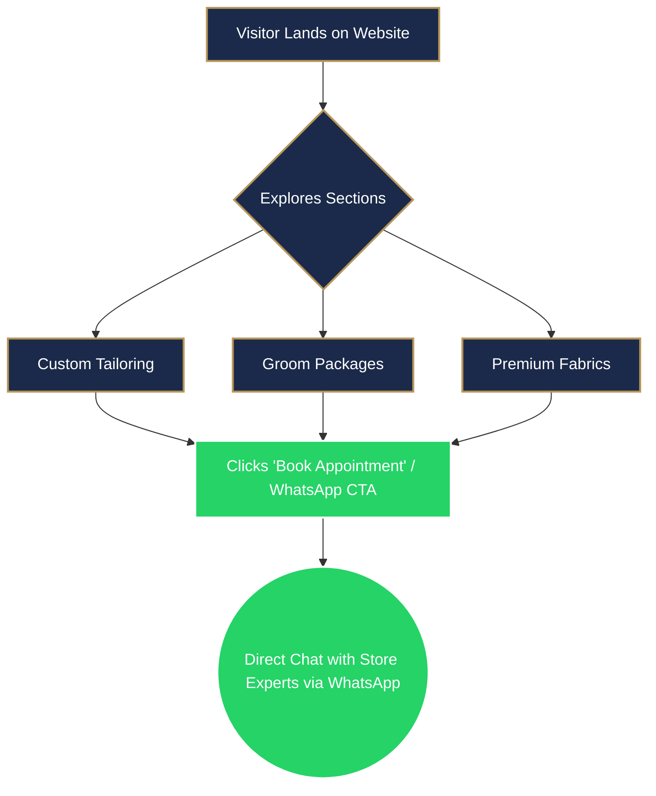

<div align="center">


# 🪡 Karan Cloth Store

**Premium Men's Tailoring & Fabric Landing Page**

[](#)
[](#)
[](#)

A high-performance, aesthetically pleasing landing page designed for **Karan Cloth Store**. This project brings a traditional tailoring and fabric business into the digital era with a premium, bespoke online experience.

</div>

---

## 📖 Overview

Karan Cloth Store is a legacy menswear business in Jodhpur, known for its premium fabrics and expert tailoring. This landing page is built to:
- **Digitalize** a traditional business model.
- **Enhance Local SEO** and online presence in the local market.
- **Showcase Services** like custom tailoring, groom packages, and luxury fabrics.
- **Drive Conversions** directly to WhatsApp for inquiries and consultations.

## 💻 Design Preview



## 🔄 User Journey Flow



## ✨ Features

- 🎨 **Premium Aesthetic**: Elegant dark navy and gold color palette that reflects luxury and bespoke craftsmanship.
- 📱 **Fully Responsive**: Mobile-first design that looks stunning across all devices.
- 🚀 **High Performance**: Zero dependencies; pure HTML, CSS, and Vanilla JavaScript for instant load times.
- 💬 **WhatsApp Integration**: Floating CTAs and direct booking links for seamless customer interaction.
- 🪄 **Dynamic Animations**: Smooth scroll reveals and micro-interactions for a modern feel.
- 🗺️ **Local SEO Ready**: Structured with semantic tags and meta descriptions optimized for local search queries.

## 🛠️ Tech Stack

- **HTML5**: Semantic and accessible structure.
- **Vanilla CSS3**: Custom properties, Flexbox/Grid layouts, and keyframe animations.
- **Vanilla JavaScript**: Lightweight interactions, sticky navigation, and scroll observers.

## 📂 Project Structure

```text
karan-cloth-store-official/
├── assets/
│   ├── banner.png     # README Banner
│   └── mockup.png     # Site Mockup Preview
├── index.html         # Main landing page containing markup, styles, and scripts
└── README.md          # Project documentation
```

## 🚀 Getting Started

Since this is a static, vanilla web project, getting started is incredibly simple:

1. Clone the repository:
   ```bash
   git clone https://github.com/Karandaiya88/karan-cloth-store-official.git
   ```
2. Navigate to the project directory:
   ```bash
   cd karan-cloth-store-official
   ```
3. Open `index.html` in your favorite web browser! You can also use extensions like **Live Server** in VS Code for hot-reloading during development.

## 🎯 What's Next? (Roadmap)

- [ ] Add actual high-quality imagery for the store and groom wear in the `index.html`.
- [ ] Embed the Google Business Profile (GBP) Map integration once the profile is verified.
- [ ] Connect a custom domain.

---

<div align="center">
  <p>Crafted with precision for Karan Cloth Store, Jodhpur.</p>
</div>
